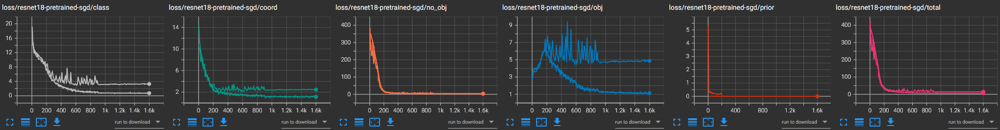

# YOLO v2 PyTorch Implementation

**I wrote this repo for the purpose of learning, aimed to reproduce YOLO v2 using PyTorch.** Most of the **ideas** were adopted from the [original paper](https://arxiv.org/pdf/1612.08242.pdf), ~~but ... it is **extremely difficult to decrypt the mysterious code of Darknet**, so ... I crafted my own version on some designs.~~ Indeed it is **extremely difficult to decrypt the mysterious code of Darknet**, with the help of [Alexey](https://github.com/AlexeyAB)'s answers (links will be given in reference section), I managed to understand how things were going on for the modifications of different versions of YOLO.

As normal, I do not have the condition to pretrain myself, so I modified the architecture and mainly focused on the implementation of ideas and loss of YOLO.

Most hyperparameters are adapted from the original implementation of Darknet.

Besides, compared with the [YOLO v1 I implemented](https://github.com/JeffersonQin/yolo-v1-pytorch), I believed this version is pretty nice and the code is far more organized, and the efficiency of mAP calculation is improved tremendously, I've made it possible to calculate mAP each epoch with considerable time cost. Here comes the project structure.

```
.
├── kmeans.py             # script to calculate prior box on VOC train dataset
├── train_yolov2.py       # train yolo v2 Darknet19 (w/o pretrain)
├── train_resnet18.py     # train yolo v2 ResNet18 (w/ pretrain)
├── test_resnet18.py      # test yolo v2 ResNet18 (w/ pretrain)
├── train_resnet101.py    # train yolo v2 ResNet101 (w/ pretrain)
├── test_resnet101.py     # test yolo v2 ResNet101 (w/ pretrain)
├── utils                 # utils
│   ├── __init__.py
│   ├── data.py           # data pipeline, augmentation
│   ├── globalvar.py      # global variable
│   ├── metrics.py        # mAP calculation
│   ├── utils.py          # utils
│   ├── visualize.py      # visualization
│   └── winit.py          # weight init
└── yolo                  # YOLO model related
    ├── __init__.py
    ├── converter.py      # data converter, BBox <=> model output
    ├── loss.py           # YOLO loss module
    ├── model.py          # network
    ├── nms.py            # non-maximum suppression
    └── train.py          # trainer
```

Note: in this repo I no longer use Jupyter Notebook as it is heavy and not easy to manipulate. From now on, the data visualization are implemented through [tensorboard](https://pytorch.org/docs/stable/tensorboard.html). The default log dir is `./logs`

Tensorboard installation:

```bash
pip install tensorboard
```

Check tensorboard:

```bash
tensorboard --logdir ./logs
```

## YOLO v2 Features

* ✅: Implemented and used
* ❌: Not implemented
* \*: Not available for other backbones

|   Tricks in Paper   | Used  |        Additional Tricks         | Used  |
| :-----------------: | :---: | :------------------------------: | :---: |
|      BatchNorm      |   ✅   |      Gradient Accumulation       |   ✅   |
|  Hi-Res Classifier  |   ❌   | ResNet Backbone with Passthrough |   ✅   |
|    Convolutional    |   ✅   |    Global Responsible in Loss    |   ✅   |
|     Anchor Box      |   ✅   |
|     New Network     |  ✅*   |
|   Dimension Prior   |   ✅   |
| Location Prediction |   ✅   |
|     Passthrough     |   ✅   |
|     Multi-scale     |   ✅   |
|   Hi-Res Detector   |   ✅   |

## YOLO v2 Loss

Loss function of YOLO v2 was not given explicitly from the paper. I've tried my best to read the source code of Darknet... And, the good news is, here it is!

<!-- $$
	\begin{aligned}
		&\lambda_{\text{coord}} \sum_{i=1}^{S^2}\sum_{j=1}^B 1_{ij}^{\text{obj}} [(b_{x_i}-\hat b_{x_{ij}})^2 + (b_{y_i}-\hat b_{y_{ij}})^2 + (t_{w_i}-\hat t_{w_{ij}})^2 + (t_{h_i}-\hat t_{h_{ij}})^2] \\
		+&\lambda_{\text{class}} \sum_{i=1}^{S^2}\sum_{j=1}^B 1_{ij}^{\text{obj}} \sum_{c\in \text{classes}} (p_i(c) - \hat p_{ij}(c))^2 \\ 
		+&\lambda_{\text{noobj}} \sum_{i=1}^{S^2}\sum_{j=1}^B 1_{\text{MaxIoU}_{ij} < \text{IoUThres}}(C_{ij} - \hat C_{ij})^2 \\ 
		+&\lambda_{\text{obj}} \sum_{i=1}^{S^2}\sum_{j=1}^B 1_{ij}^{\text {obj}} (C_{ij} - \hat C_{ij})^2 \\
		+&\lambda_{\text{prior}} \sum_{i=1}^{S^2}\sum_{j=1}^B 1_{\text{iter} < 12800} [(\hat w_{ij} - p(w)_{j})^2 + (\hat h_{ij} - p(h)_{j})^2] 
	\end{aligned}
$$ --> 

<div align="center"></div>

Here are some explanation.

* Coordinate loss. For `x` and `y`, the difference between the bounding box value are calculated, and for `w` and `h`, the difference between the *converted format of direct feature map output* is calculated. Also, only responsible box loss are calculated.
  * https://github.com/AlexeyAB/darknet/blob/573d7e80814a4cc3c08897f6c0f67ea189339856/src/region_layer.c#L92-L111
  * https://github.com/AlexeyAB/darknet/blob/573d7e80814a4cc3c08897f6c0f67ea189339856/src/region_layer.c#L294-L331
* Class loss. Responsible boxes only.
  * https://github.com/AlexeyAB/darknet/blob/573d7e80814a4cc3c08897f6c0f67ea189339856/src/region_layer.c#L151-L157
  * https://github.com/AlexeyAB/darknet/blob/573d7e80814a4cc3c08897f6c0f67ea189339856/src/region_layer.c#L345
* Objectness loss.
  * If maximum IoU with ground truth greater than the ignore threshold, objectness loss will be ignored, else objectness loss will be calculated.
  * https://github.com/AlexeyAB/darknet/blob/573d7e80814a4cc3c08897f6c0f67ea189339856/src/region_layer.c#L267-L271
  * Objectness loss of responsible boxes will also be calculated.
  * https://github.com/AlexeyAB/darknet/blob/573d7e80814a4cc3c08897f6c0f67ea189339856/src/region_layer.c#L345
* Prior box loss. Used to study the shape of anchor boxes in the first 12800 iterations.
  * https://github.com/AlexeyAB/darknet/blob/573d7e80814a4cc3c08897f6c0f67ea189339856/src/region_layer.c#L279-L290

Furthermore, the loss implementation in this repo has solved the problem of multiple instance in one single cell by calculation global IoU and performing global responsible object selection algorithm.

## Performance

|          Model          |  Size   | Backbone  | mAP@VOC2012-val | COCOmAP@VOC2012-val | FPS@RTX2070s |
| :---------------------: | :-----: | :-------: | :-------------: | :-----------------: | :----------: |
| YOLOv1-ResNet18 (Ours)  | 448x448 | ResNet18  |     48.10%      |       23.18%        |  **97.88**   |
| YOLOv1-ResNet50 (Ours)  | 448x448 | ResNet50  |     49.87%      |       23.95%        |    58.40     |
| YOLOv2-ResNet18 (Ours)  | 544x544 | ResNet18  |     56.26%      |       27.12%        |    76.83     |
| YOLOv2-ResNet101 (Ours) | 544x544 | ResNet101 |   **64.40%**    |     **35.06%**      |    28.92     |

|          Model          |  Size   | Backbone  | mAP@VOC2012-test |    FPS    |
| :---------------------: | :-----: | :-------: | :--------------: | :-------: |
| YOLOv1-ResNet18 (Ours)  | 448x448 | ResNet18  |      44.54%      | **97.88** |
| YOLOv1-ResNet50 (Ours)  | 448x448 | ResNet50  |      47.28%      |   58.40   |
| YOLOv2-ResNet18 (Ours)  | 544x544 | ResNet18  |      56.11%      |   76.83   |
| YOLOv2-ResNet101 (Ours) | 544x544 | ResNet101 |    **64.06%**    |   28.92   |
|         YOLOv1          | 448x448 | Darknet?  |      57.9%       |    45     |
|       YOLOv2 544        | 544x544 | Darknet19 |    **73.4%**     |    40     |

Leaderboard Link:

* Our [YOLOv1-ResNet18](http://host.robots.ox.ac.uk:8080/leaderboard/displaylb_main.php?challengeid=11&compid=3#KEY_YOLOv1-resnet-18-50)
* Our [YOLOv1-ResNet50](http://host.robots.ox.ac.uk:8080/leaderboard/displaylb_main.php?challengeid=11&compid=4#KEY_YOLOv1-resnet-18-50)
* Our [YOLOv2-ResNet18](http://host.robots.ox.ac.uk:8080/leaderboard/displaylb_main.php?challengeid=11&compid=3#KEY_YOLOv2-resnet-18-101)
* Our [YOLOv2-ResNet101](http://host.robots.ox.ac.uk:8080/leaderboard/displaylb_main.php?challengeid=11&compid=4#KEY_YOLOv2-resnet-18-101)

More comparison across categories:


|          Model          | mean  | aero plane | bicycle | bird  | boat  | bottle |  bus  |  car  |  cat  | chair |  cow  |
| :---------------------: | :---: | :--------: | :-----: | :---: | :---: | :----: | :---: | :---: | :---: | :---: | :---: |
|          YOLO           | 57.9  |    77.0    |  67.2   | 57.7  | 38.3  |  22.7  | 68.3  | 55.9  | 81.4  | 36.2  | 60.8  |
|         YOLOv2          | 75.4  |    86.6    |  85.0   | 76.8  | 61.1  |  55.5  | 81.2  | 78.2  | 91.8  | 56.8  | 79.6  |
| YOLOv1-ResNet18 (Ours)  | 44.5  |    64.3    |  54.2   | 47.4  | 26.8  |  16.6  | 55.4  | 44.3  | 66.5  | 23.1  | 38.1  |
| YOLOv1-ResNet50 (Ours)  | 47.3  |    66.7    |  56.1   | 49.5  | 25.9  |  17.8  | 60.2  | 45.9  | 70.6  | 26.1  | 43.0  |
| YOLOv2-ResNet18 (Ours)  | 56.1  |    74.3    |  66.4   | 59.4  | 37.0  |  34.4  | 65.1  | 63.3  | 74.4  | 38.5  | 53.3  |
| YOLOv2-ResNet101 (Ours) | 64.1  |    80.2    |  71.8   | 67.7  | 50.5  |  45.3  | 72.3  | 71.9  | 79.6  | 45.5  | 61.9  |

|          Model          | dining<br>table |  dog  | horse | motor<br>bike | person | potted<br>plant | sheep | sofa  | train | tv<br>monitor |
| :---------------------: | :-------------: | :---: | :---: | :-----------: | :----: | :-------------: | :---: | :---: | :---: | :-----------: |
|          YOLO           |      48.5       | 77.2  | 72.3  |     71.3      |  63.5  |      28.9       | 52.2  | 54.8  | 73.9  |     50.8      |
|         YOLOv2          |      61.7       | 89.7  | 86.0  |     85.0      |  84.2  |      51.2       | 79.4  | 62.9  | 84.9  |     71.0      |
| YOLOv1-ResNet18 (Ours)  |      38.5       | 62.9  | 57.6  |     60.8      |  45.0  |      15.2       | 33.3  | 43.9  | 60.0  |     37.2      |
| YOLOv1-ResNet50 (Ours)  |      41.1       | 67.5  | 59.2  |     62.4      |  47.6  |      17.6       | 35.6  | 45.7  | 64.6  |     42.4      |
| YOLOv2-ResNet18 (Ours)  |      40.9       | 68.4  | 61.7  |     68.0      |  68.9  |      30.2       | 51.7  | 47.7  | 66.7  |     52.0      |
| YOLOv2-ResNet101 (Ours) |      47.6       | 77.1  | 66.6  |     75.1      |  75.4  |      42.4       | 63.3  | 55.6  | 73.7  |     58.0      |

2022/05/18 Update: I fixed a bug in the NMS (Non-maximum suppression) module of the model, and increased the mAP astonishingly for more than 7%. However here also comes the sad news. The model selection done in the current stage is based on the previous buggy code. As a student with poor experiment conditions, the parameter adjustion and model selection cost me for more than a week, so ... no new trained weights would be released, and I will put my efforts on YOLO v3 and later models.

## About Dimension Prior

<div align="center">
	
</div>

It is known that in [YOLO v2](https://arxiv.org/pdf/1612.08242.pdf) and [YOLO v3](https://arxiv.org/pdf/1804.02767.pdf), anchor boxes were used. Here we implemented the k-means algorithm for finding dimension priors in `kmeans.py`, and the graph above are 5 priors we obtained by identifying k = 5.

If you want to run it by yourself, simply try

```
python kmeans.py
```

## Training

ResNet18

```
python train_resnet18.py
```

ResNet101

```
python train_resnet101.py
```

Note: similar to [my YOLO v1 implementation](https://github.com/JeffersonQin/yolo-v1-pytorch), you should add `download=True` to `load_data_voc` in the training scripts for the first time if the datasets are not ready.

Here are some diagrams.



## Testing

Weights are already released. Download and put into `./model`.

Here are the trained weights list provided.

|                     File Name                      |    Size     | Backbone  | Final | Type  |           Note            |
| :------------------------------------------------: | :---------: | :-------: | :---: | :---: | :-----------------------: |
|       resnet18-pretrained-sgd-epoch-160.pth        |   544x544   | ResNet18  |   ✔   | Model |                           |
|    resnet101-pretrained-sgd-17x17-epoch-160.pth    |   544x544   | ResNet101 |   ✔   | Model |                           |
| resnet101-pretrained-sgd-multi-epoch-150-optim.pth | Multi-scale | ResNet101 |   ❌   | Optim | Used for further training |
| resnet101-pretrained-sgd-multi-epoch-150-model.pth | Multi-scale | ResNet101 |   ❌   | Model | Used for further training |

ResNet18

```
python test_resnet18.py
```

ResNet 101

```
python test_resnet101.py
```

## Troubleshooting

The following problem may caused by lack of memory. Try setting `S`, `batch_size` smaller or `crop` bigger.

```
Traceback (most recent call last):
  File "C:\Users\JeffersonQin\Desktop\yolo-v2-pytorch\train_resnet18.py", line 59, in <module>
    train(detector, train_iter, test_iter, num_epoch, multi_scale_epoch, output_scale_S, lr, optimizer, 'resnet18-pretrained-sgd', loss, 1, accum_batch_num, './model', './model/resnet18-pretrained-sgd-model-86.pth', './model/resnet18-pretrained-sgd-optim-86.pth', 86)
  File "C:\Users\JeffersonQin\Desktop\yolo-v2-pytorch\yolo\train.py", line 123, in train
    loss_val.sum().backward()
  File "C:\Users\JeffersonQin\AppData\Local\Programs\Python\Python39\lib\site-packages\torch\_tensor.py", line 363, in backward
    torch.autograd.backward(self, gradient, retain_graph, create_graph, inputs=inputs)
  File "C:\Users\JeffersonQin\AppData\Local\Programs\Python\Python39\lib\site-packages\torch\autograd\__init__.py", line 173, in backward
    Variable._execution_engine.run_backward(  # Calls into the C++ engine to run the backward pass
RuntimeError: Unable to find a valid cuDNN algorithm to run convolution
```

Example of setting `S` smaller:

```python
G.set('S', 17)
```

Here you can optimizing `crop` strategy:

* https://github.com/JeffersonQin/yolo-v2-pytorch/blob/7826530c4d6df3e4d5ceeca3bd30123a5d1126c9/yolo/loss.py#L137-L140

Tuning `batch_size` and `accum_batch_num`:

* https://github.com/JeffersonQin/yolo-v2-pytorch/blob/7826530c4d6df3e4d5ceeca3bd30123a5d1126c9/train_resnet18.py#L20-L21

If you have any *problems* or *questions*, feel free to ask and open issues.

## Thanks

* https://arxiv.org/pdf/1612.08242.pdf
* https://arxiv.org/pdf/1804.02767.pdf
* https://github.com/AlexeyAB/darknet/issues/821
* [YOLO v2 损失函数源码分析](https://www.cnblogs.com/YiXiaoZhou/p/7429481.html)
* [Training Object Detection (YOLOv2) from scratch using Cyclic Learning Rates](https://towardsdatascience.com/training-object-detection-yolov2-from-scratch-using-cyclic-learning-rates-b3364f7e4755)
* Also big thanks to [@dmMaze](https://github.com/dmMaze)
