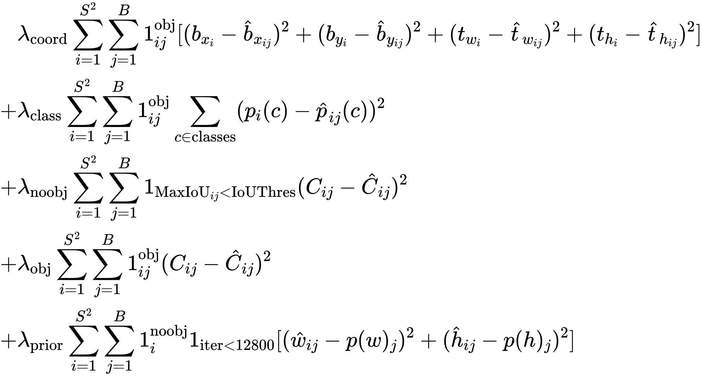
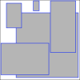

# YOLO v2 PyTorch Implementation

**I wrote this repo for the purpose of learning, aimed to reproduce YOLO v2 using PyTorch.** Most of the **ideas** were adopted from the [original paper](https://arxiv.org/pdf/1612.08242.pdf), ~~but ... it is **extremely difficult to decrypt the mysterious code of Darknet**, so ... I crafted my own version on some designs.~~ Indeed it is **extremely difficult to decrypt the mysterious code of Darknet**, with the help of [Alexey](https://github.com/AlexeyAB)'s answers (links will be given in reference section), I managed to understand how things were going on for the modifications of different versions of YOLO.

As normal, I do not have the condition to pretrain myself, so I modified the architecture and mainly focused on the implementation of ideas and loss of YOLO.

Most hyperparameters are adapted from the original implementation of Darknet.

Besides, compared with the [YOLO v1 I implemented](https://github.com/JeffersonQin/yolo-v1-pytorch), I believed this version is pretty nice and the code is far more organized, and the efficiency of mAP calculation is improved tremendously, I've made it possible to calculate mAP each epoch with considerable time cost. Here comes the project structure.

```
.
├── kmeans.py             # script to calculate prior box on VOC train dataset
├── train_yolov2.py       # train yolo v2 Darknet19 (w/o pretrain)
├── utils                 # utils
│   ├── __init__.py
│   ├── data.py           # data pipeline, augmentation
│   ├── globalvar.py      # global variable
│   ├── metrics.py        # mAP calculation
│   ├── utils.py          # utils
│   ├── visualize.py      # visualization
│   └── winit.py          # weight init
└── yolo                  # YOLO model related
    ├── __init__.py
    ├── converter.py      # data converter, BBox <=> model output
    ├── loss.py           # YOLO loss module
    ├── model.py          # network
    ├── nms.py            # non-maximum suppression
    └── train.py          # trainer
```

## YOLO v2 Features

* ✅: Implemented and used
* ❌: Not implemented
* \*: Not available for other backbones

|       Tricks        | Used  |
| :-----------------: | :---: |
|      BatchNorm      |   ✅   |
|  Hi-Res Classifier  |   ❌   |
|    Convolutional    |   ✅   |
|     Anchor Box      |   ✅   |
|     New Network     |  ✅*   |
|   Dimension Prior   |   ✅   |
| Location Prediction |   ✅   |
|     Passthrough     |   ✅   |
|     Multi-scale     |   ✅   |
|   Hi-Res Detector   |   ✅   |

## YOLO v2 Loss

Loss function of YOLO v2 was not given explicitly from the paper. I've tried my best to read the source code of Darknet... And, the good news is, here it is!

<!-- $$
	\begin{aligned}
		&\lambda_{\text{coord}} \sum_{i=1}^{S^2}\sum_{j=1}^B 1_{ij}^{\text{obj}} [(b_{x_i}-\hat b_{x_{ij}})^2 + (b_{y_i}-\hat b_{y_{ij}})^2 + (t_{w_i}-\hat t_{w_{ij}})^2 + (t_{h_i}-\hat t_{h_{ij}})^2] \\
		+&\lambda_{\text{class}} \sum_{i=1}^{S^2}\sum_{j=1}^B 1_{ij}^{\text{obj}} \sum_{c\in \text{classes}} (p_i(c) - \hat p_{ij}(c))^2 \\ 
		+&\lambda_{\text{noobj}} \sum_{i=1}^{S^2}\sum_{j=1}^B 1_{\text{MaxIoU}_{ij} < \text{IoUThres}}(C_{ij} - \hat C_{ij})^2 \\ 
		+&\lambda_{\text{obj}} \sum_{i=1}^{S^2}\sum_{j=1}^B 1_{ij}^{\text {obj}} (C_{ij} - \hat C_{ij})^2 \\
		+&\lambda_{\text{prior}} \sum_{i=1}^{S^2}\sum_{j=1}^B 1_{\text{iter} < 12800} [(\hat w_{ij} - p(w)_{j})^2 + (\hat h_{ij} - p(h)_{j})^2] 
	\end{aligned}
$$ --> 

<div align="center"></div>

Here are some explanation.

* Coordinate loss. For `x` and `y`, the difference between the bounding box value are calculated, and for `w` and `h`, the difference between the *converted format of direct feature map output* is calculated. Also, only responsible box loss are calculated.
  * https://github.com/AlexeyAB/darknet/blob/573d7e80814a4cc3c08897f6c0f67ea189339856/src/region_layer.c#L92-L111
  * https://github.com/AlexeyAB/darknet/blob/573d7e80814a4cc3c08897f6c0f67ea189339856/src/region_layer.c#L294-L331
* Class loss. Responsible boxes only.
  * https://github.com/AlexeyAB/darknet/blob/573d7e80814a4cc3c08897f6c0f67ea189339856/src/region_layer.c#L151-L157
  * https://github.com/AlexeyAB/darknet/blob/573d7e80814a4cc3c08897f6c0f67ea189339856/src/region_layer.c#L345
* Objectness loss.
  * If maximum IoU with ground truth greater than the ignore threshold, objectness loss will be ignored, else objectness loss will be calculated.
  * https://github.com/AlexeyAB/darknet/blob/573d7e80814a4cc3c08897f6c0f67ea189339856/src/region_layer.c#L267-L271
  * Objectness loss of responsible boxes will also be calculated.
  * https://github.com/AlexeyAB/darknet/blob/573d7e80814a4cc3c08897f6c0f67ea189339856/src/region_layer.c#L345
* Prior box loss. Used to study the shape of anchor boxes in the first 12800 iterations.
  * https://github.com/AlexeyAB/darknet/blob/573d7e80814a4cc3c08897f6c0f67ea189339856/src/region_layer.c#L279-L290

## About Dimension Prior

<div align="center">
	
</div>

It is known that in [YOLO v2](https://arxiv.org/pdf/1612.08242.pdf) and [YOLO v3](https://arxiv.org/pdf/1804.02767.pdf), anchor boxes were used. Here we implemented the k-means algorithm for finding dimension priors in `kmeans.py`, and the graph above are 5 priors we obtained by identifying k = 5.

If you want to run it by yourself, simply try

```
python kmeans.py
```

## Thanks

* https://arxiv.org/pdf/1612.08242.pdf
* https://arxiv.org/pdf/1804.02767.pdf
* https://github.com/AlexeyAB/darknet/issues/821
* [YOLO v2 损失函数源码分析](https://www.cnblogs.com/YiXiaoZhou/p/7429481.html)
* [Training Object Detection (YOLOv2) from scratch using Cyclic Learning Rates](https://towardsdatascience.com/training-object-detection-yolov2-from-scratch-using-cyclic-learning-rates-b3364f7e4755)
* Also big thanks to [@dmMaze](https://github.com/dmMaze)
